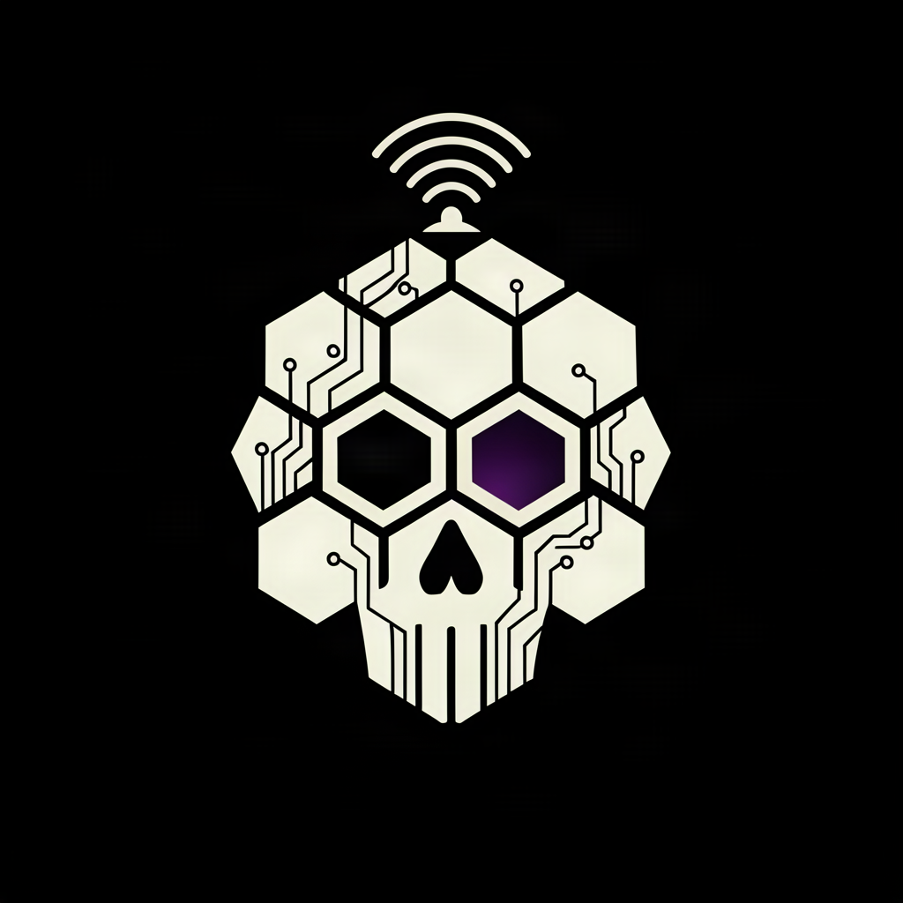

# MortemHive Hotspot



**A flash-and-go SD image for the Raspberry Pi Zero W (v1.1) + MMDVM hotspot hat
(SSD1306 OLED) — a Pi-Star build that doesn't lock up like the current "latest",
with a custom dashboard you'll actually enjoy glancing at.**

## Why this exists

Recent Pi-Star images ship a kernel (6.12.x) affected by **CVE-2026-31648** — a
memory-corruption race in the page-fault path that can hard-lock the Pi under
ordinary SD-card I/O (kernel upgrades, log churn, you name it). One hotspot built
on such an image kept seizing up; in-place kernel upgrades kept getting killed by
the bug itself. The fix that worked: go back to the **4.2.3 release** whose
**5.10.103 kernel predates the bug**, then rebuild the experience on top of it.

This image is that escape hatch, packaged for everyone with the same hardware.
(*Bug references: CVE-2026-31648; upstream fix commit `9316a820b9aae07d44469d6485376dad824c5b3f` — verified against the kernel stable tree during the original debugging session.*)

## What's inside

- **Pi-Star 4.2.3** (build 18-Apr-2025) / kernel **5.10.103** — not affected by the lockup bug
- **Custom OLED dashboard** (`hotspot-oled-dash.py`)
  - Status screen: callsign, network badge, last-heard talkgroup, TX strip (inverted when *you* transmit), clock — with a **liveness comet** orbiting the top-right corner every 0.5 s (a frozen dot means something's wrong)
  - Idle carousel: status → Wi-Fi (dBm/SSID/IP) → system (temp/uptime/load) → mascot screen
  - Your callsign and DMR ID are read from `/etc/mmdvmhost` — nothing personal is baked in
- **Reliability shields, armed by default**
  - systemd feeds the hardware watchdog (`RuntimeWatchdogSec=15`, the chip's maximum) — a truly hung system reboots itself
  - `hung_task_panic=1` (120 s) + `panic=10` — D-state/SD freezes self-recover
- **No-transmit guard** — while the callsign *or the DMR ID* is still a stock placeholder, systemd **refuses to start** the modem services (an `ExecStartPre` check on MMDVMHost + DMRGateway). The unit **cannot key up** until you configure a real callsign and ID — and the refusal holds even against Pi-Star's own service watchdog, which cannot restart a service that refuses to start. (47 CFR 97.119 isn't optional, even for a Raspberry Pi.)
- **DMRGateway pre-wired for BrandMeister 3102** (you supply your own hotspot password). TGIF is pre-wired but ships **disabled** — enable it in the dashboard if you want it.
- **Clean slate**: no callsign, no saved WiFi, no location, no passwords. The build runs a two-layer PII audit (`build/pii-audit.sh`) and fails if anything personal sneaks in.

## Flash it

1. **Raspberry Pi Imager** → *Choose OS* → *Use custom* → select `MORTEMHIVE-Hotspot-v1.2.zip`
2. Flash an 8 GB+ card. After flashing, macOS may say the disk is "not readable" — that's the ext4 partition, it's normal.
3. **Get it on WiFi.** Nothing is pre-configured. Best: **before first boot**, drop a `wpa_supplicant.conf` (country=US + your network block) on the boot volume. Or boot it and join the `Pi-Star-Setup` access point from your phone (~2 minutes after power-up). *The first boot needs internet once* — the OLED dependency install can't run without it (it retries on every boot until it succeeds — no harm done).
4. **Be patient on first boot.** The dependency install (pip, on a single-core Zero) can take several **minutes**. A dark screen during that window is expected.
5. **Set your callsign + DMR ID** at `http://pi-star.local` (default login `pi-star` / `raspberry` — change it). Until you do, the no-transmit guard keeps the radio off — by design.
6. Watch the OLED: splash → dashboard with the comet spinning. On an unconfigured unit the status screen shows `SET CALLSIGN + ID`.

Verify your download first:

```bash
shasum -a 256 MORTEMHIVE-Hotspot-v1.2.zip    # compare against the release's .sha256
```

## The fine print

- Add your BrandMeister hotspot security password + TGIF password via the Pi-Star
  dashboard (or edit `/etc/dmrgateway`); they ship as empty/`CHANGE_ME`.
- APRS gateway ships **disabled** — enable it in the dashboard if you want it.
- The dashboard shows `N0CALL` until you set your callsign — that's the point.

## Build your own / restore onto a fresh Pi-Star

- `build/` — full reproducible build pipeline (`build-mortemhive-image.sh`, requires a
  Linux host with loop devices; base zip from pistar.uk, matches this image)
- `deploy/` — `deploy-to-fresh-pistar.sh <ip>` installs the dashboard + shields onto a
  freshly flashed stock Pi-Star, no re-imaging needed. (Existing WiFi configs are
  backed up, never clobbered.)
- `extras/wifi-resilience/` — optional network watchdog + WiFi power-save fix for
  units living on flaky 2.4 GHz WiFi

## Credits

Built on **Pi-Star** (Andy Taylor, MW0MWZ) and the **MMDVM** ecosystem —
MMDVMHost & DMRGateway by Jonathan Naylor, G4KLX (GPL). OLED rendering via
[luma.oled](https://github.com/rm-hull/luma.oled). Dashboard, shields, image
assembly and the liveness comet by **Nyx** of MortemHive.

Use at your own risk; amateur radio rules are yours to follow. 73 🖤
